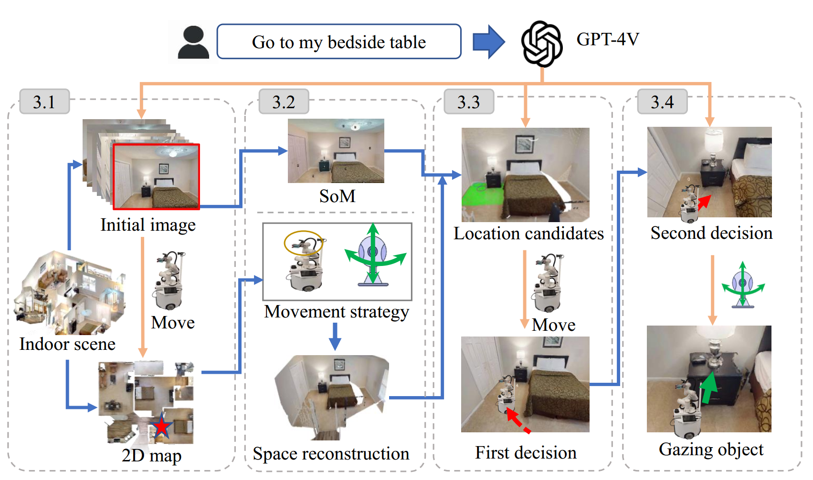

# [<b>Navi2Gaze: Leveraging Foundation Models for Navigation and Target Gazing</b>](https://arxiv.org/abs/2407.09053)

we develop a VLM-driven method called Navigation-to-Gaze (**Navi2Gaze**) for efficient navigation and object gazing based on task descriptions. This method uses the VLM to score and select the best pose from numerous candidates automatically. In evaluations on multiple photorealistic simulation benchmarks, **Navi2Gaze** significantly outperforms existing approaches and precisely determines the optimal orientation relative to target objects.

## Approach


## Quick Start

### Dependencies installation

To begin on your own machine, clone this repository locally
```bash
git clone https://github.com/zhujun3753/Navi2Gaze.git
```
Install requirements:
```bash
conda create -n navi2gaze python=3.9
conda activate navi2gaze

conda install pytorch==2.1.0 torchvision==0.16.0 torchaudio==2.1.0 pytorch-cuda=11.8 -c pytorch -c nvidia
python -m pip install 'git+https://github.com/facebookresearch/detectron2.git'
conda install habitat-sim -c conda-forge -c aihabitat
pip install -r requirements.txt

# install SEEM
pip install git+https://github.com/UX-Decoder/Segment-Everything-Everywhere-All-At-Once.git@package

# install SAM
pip install git+https://github.com/facebookresearch/segment-anything.git

# install Semantic-SAM
pip install git+https://github.com/UX-Decoder/Semantic-SAM.git@package

# install Deformable Convolution for Semantic-SAM
cd ops && sh make.sh && cd ..

cd thirdparty/octree_map && sh run.sh && cd -

# common error fix:
python -m pip install 'git+https://github.com/MaureenZOU/detectron2-xyz.git'
```

### Download `clip-vit-base-patch32`
Download [clip-vit-base-patch32](https://huggingface.co/openai/clip-vit-base-patch32/tree/main) into `openai/clip-vit-base-patch32`

### Fix bug
If necessary, add `from mpi4py import MPI` to `/home/xxx/anaconda3/envs/navi2gaze/lib/python3.9/site-packages/seem/utils/distributed.py`

### Setup OpenAI
In order to test object goal navigation and spatial goal navigation tasks with our method, you need to setup an OpenAI API account with the following steps:
1. [Sign up an OpenAI account](https://openai.com/blog/openai-api), login your account, and bind your account with at least one payment method.
2. [Get you OpenAI API keys](https://platform.openai.com/account/api-keys), copy it.
3. Open your `~/.bashrc` file, paste a new line `export OPENAI_KEY=<your copied key>`, and save the file.


### Run Demo
```bash
# set instruction in `parsed_results = self.parse_object_goal_instruction("sit on the sofa")`
sh run.sh
```


## Citation

If you find the dataset or code useful, please cite:

```bibtex
@misc{zhu2024navi2gazeleveragingfoundationmodels,
      title={Navi2Gaze: Leveraging Foundation Models for Navigation and Target Gazing}, 
      author={Jun Zhu and Zihao Du and Haotian Xu and Fengbo Lan and Zilong Zheng and Bo Ma and Shengjie Wang and Tao Zhang},
      year={2024},
      eprint={2407.09053},
      archivePrefix={arXiv},
      primaryClass={cs.RO},
      url={https://arxiv.org/abs/2407.09053}, 
}
```

<!-- ## TODO
- [ ] **Refactor Other Mappings**
  - [ ] gradcam_map.py
  - [ ] clip_map.py
  - [ ] gtmap.py
- [ ] **Improve Navigation Stack (Looking for Contributions from the Community)**
  - [ ] the code currently uses `pyvisgraph` to build covisibility graph based on an obstacle map for navigation, which often leads to getting stuck or collisions when the robot navigates at the corner of objects (like the corner of the table). The current solution is to dilate the obstacle map before building the covisibility graph, but this will leads to closing of narrow passages (half-open door becomes closed door). I am happy to discuss solutions to this.
  - [ ] navigation stack on real robot with LiDAR, RGBD camera and other sensors. -->

## License

MIT License
